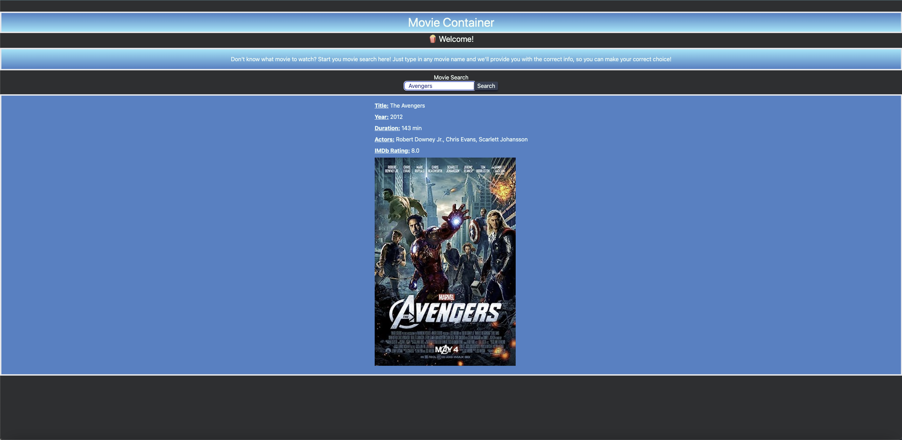

# Movie-Container

## User Story

As A **movie enthusiast**

I WANT to **look up movie ratings**

So THAT I **don’t watch a movie that I don’t find interesting**

## Acceptance Criteria

GIVEN a **movie search dashboard with a genre of categories, movie ratings, and descriptions**

WHEN I **search for a movie**

THEN I **see the actors, the genre, the director, the writer, duration, languages, ratings, and a poster of that movie**

## Description

A web page that allows you to look up any movie using a search bar. The result will yield the movie title, release year, actors in the movie, IMDb, and poster.

## Installation

N/A

## Usage

To use this web page, open the link in the browser and enter the movie desired in the search box, and hit enter. The movie information should appear on the screen.

## Website Link

[https://frankieramirez72.github.io/Movie-Container/](https://frankieramirez72.github.io/Movie-Container/)
